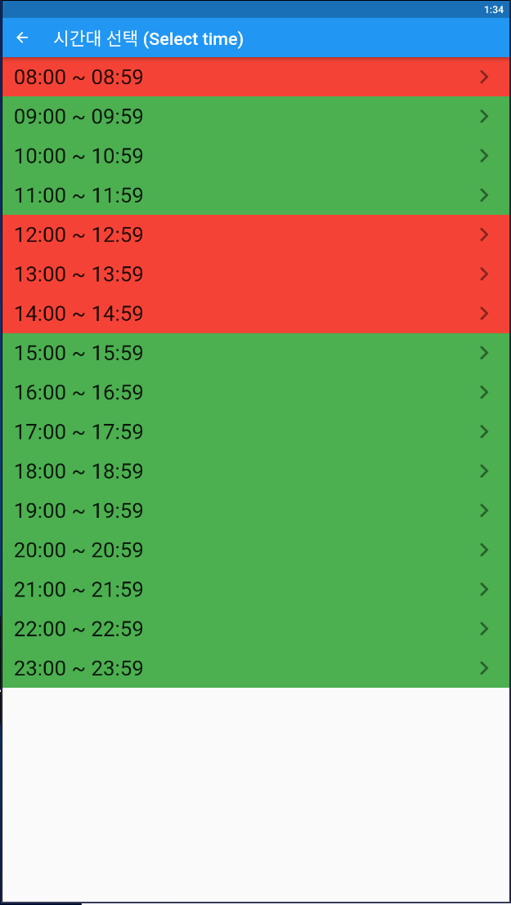
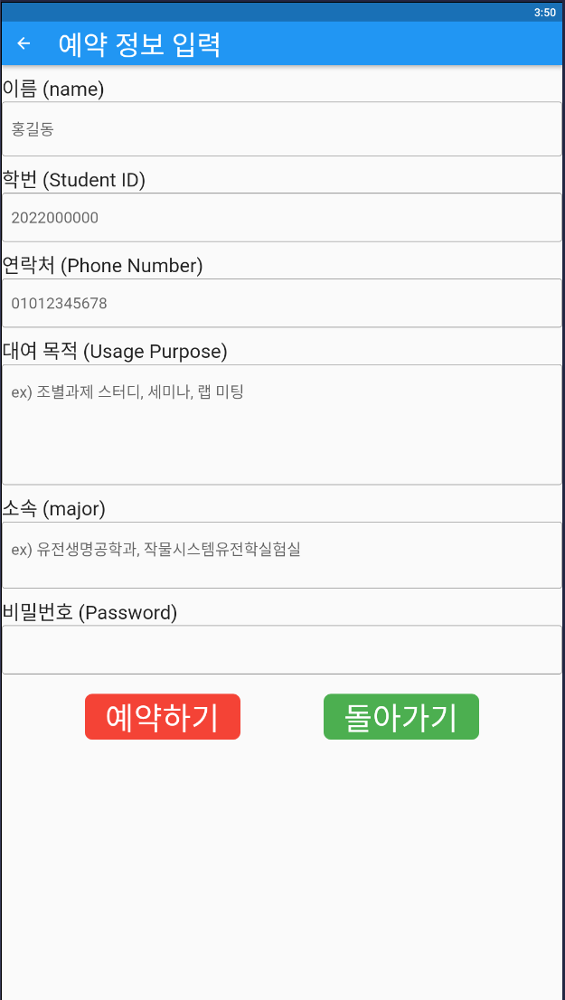
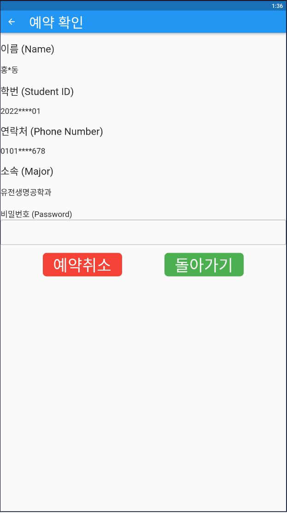

# OpenLabReservation
- 2022년 2학기 디자인적 사고 텀프로젝트  
- 경희대학교 생명과학대학 OpenLab예약 시스템
- 개발도구: 
    - 프론트엔드: flutter + android studio
    - 백엔드: Nodejs + visual studio code
    - 협업툴: SourceTree
- 개발기간: 22'10'01 ~ 22'12'03
- 팀원
    - [윤태웅](https://github.com/yuntaewoong) -개발총괄, NodeJs백엔드 개발
    - [박상준](https://github.com/Sangjun-Park-BioInfo) -Flutter 프론트엔드 개발, 예약신청 페이지, 예약 삭제 페이지, 시간선택 페이지 담당
    - [견강혁](https://github.com/justinkhun) -Flutter 프론트엔드 개발, 메인 페이지, 달력페이지 담당

# Install
apk link: [download](https://drive.google.com/file/d/17UfBL5fSorotuDky0_c_o7sV79ZmEtK_/view?usp=sharing)  
manually build: 
```
1. Backend/main.js 실행 -> 'node main.js'
2. AndroidStudio로 Flutter_Frontend디렉토리 open
3. 실행
```

# description
1. 메인 페이지  


2. 시간선택 페이지  


3. 예약 페이지  


4. 예약취소 페이지  



